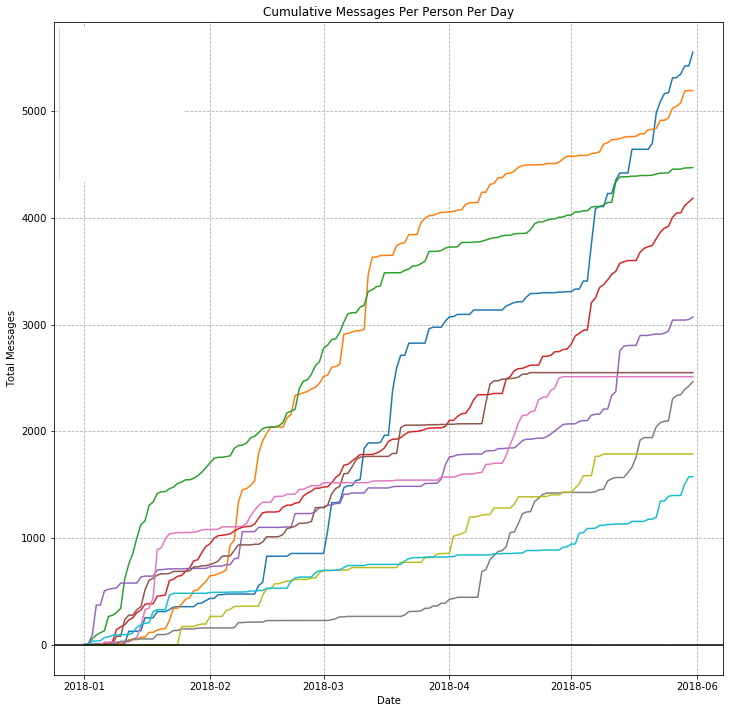
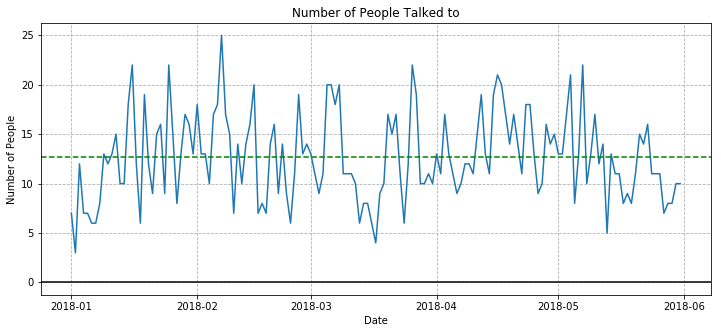
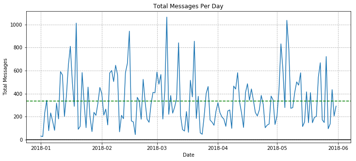

# Facebook Parser/Grapher
### Parse all of your facebook messages using _**Python3**_  
Updated June 2nd, 2018.

## Example Graphs 

## Setup
1. Clone this repository
2. Go to your Facebook settings and select "Download a copy of your Facebook data" (should be under General Account Settings)  
  a. Login to Facebook  
  b. Click the down arrow beside the question mark button  
  c. Click "Settings"  
  d. From the left sidebar click "Your Facebook Information"  
  e. Click "Download Your Information"  
  f. Make sure the formatting is "HTML" or "Json" - Remember which format you choose.  
  g. Download all of your Facebook data  
  
3. Place the unzipped download of your Facebook data into the same folder as this repository.  
4. Rename the unzipped folder to "facebook"  

## Usage
Remember, Python3 only.  
1. Install requirements  
      `pip install -r requirements.txt`
2. run the correct parser for the formatting you chose  
      `python html_parse.py` or `python json_parse.py`
3. If you have Jupyter open analyze.ipynb  and __skip step 4__  
  a. Run all the individual cells (This can easily be done by clicking "Cell" --> "Run All")  
  b. Graphs are somewhat interactive - you can zoom in and stuff  
4. run analyze.py  
      `python analyze.py`  
5. Graphs will be saved in the 'graphs' folder

## Contributing
1. Fork it!
2. Create your feature branch: `git checkout -b my-new-feature`
3. Commit your changes: `git commit -am 'Add some feature'`
4. Push to the branch: `git push origin my-new-feature`
5. Submit a pull request :D
