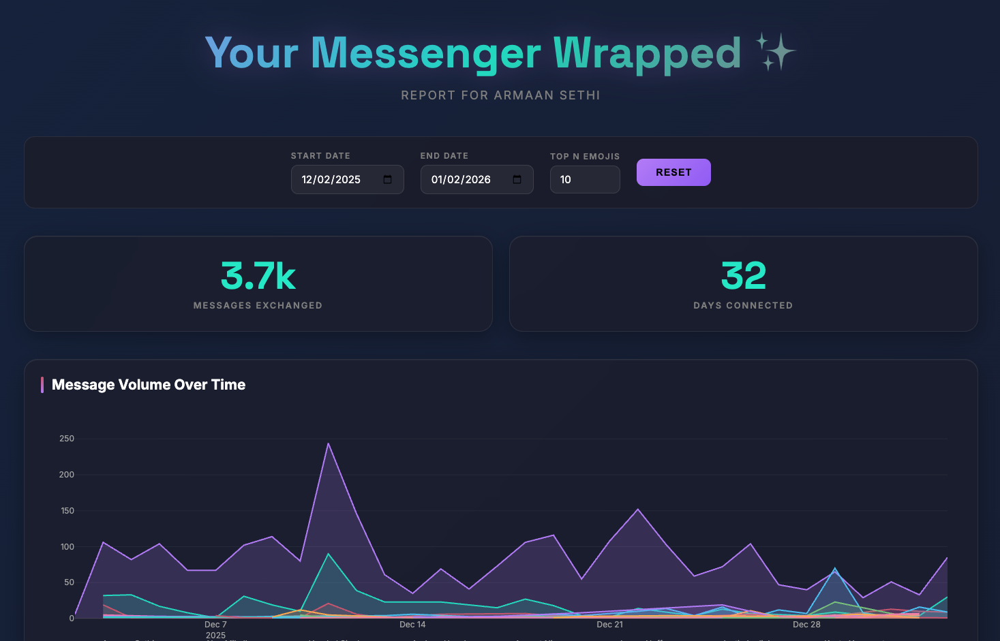
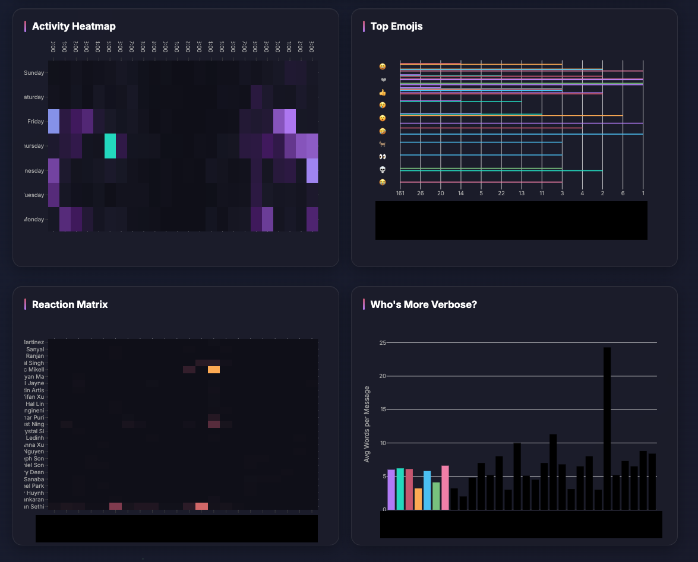
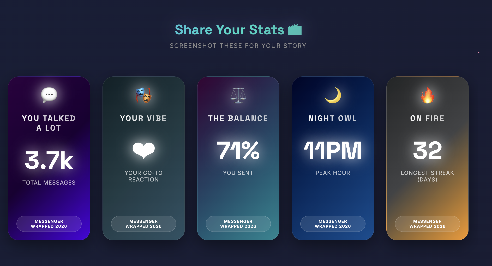

# Messenger Insights 📊

> **Privacy-first "Spotify Wrapped" for your messages.** Generate beautiful analytics from Facebook Messenger, Instagram, and WhatsApp — all processed locally on your machine.


<p align="center">
  
</p>

## ✨ Features

| Feature | Description |
|---------|-------------|
| 🎯 **Conversation Filter** | Analyze all chats or drill into a specific conversation |
| 📈 **Message Timeline** | Interactive chart of your chat activity over time |
| 🏆 **Top Chats Leaderboard** | Your most active conversations ranked |
| 🔥 **Activity Heatmap** | See when you chat most (day of week × hour) |
| ⚡ **Streak Tracking** | Longest chain of consecutive days with messages |
| 😂 **Emoji Analytics** | Top emojis you use vs. what others use |
| 🎁 **Reactions Given/Got** | Your most-used reactions vs. how people react to you |
| 💬 **Reaction Matrix** | Discover who reacts to whose messages |
| 📊 **Verbosity Stats** | Who sends more messages in each conversation |
| 📸 **Social Share Cards** | Screenshot-ready stats for your story |

<p align="center">
  
</p>

### Share-Ready Cards

<p align="center">
  
</p>

---

## 🚀 Quick Start

### 1. Request Your Data Export

<details>
<summary><strong>📘 Facebook / Messenger</strong></summary>

1. Go to [facebook.com/dyi](https://www.facebook.com/dyi)
2. Click **"Request a download"**
3. Select **JSON** format (not HTML!)
4. Select your date range (recommend "All time")  
5. Under "Your Facebook activity", select **Messages**
6. Click **"Create file"** and wait for email (can take hours/days)
</details>

<details>
<summary><strong>📸 Instagram</strong></summary>

1. Settings → Your activity → Download your information
2. Select **JSON** format
3. Wait for download link via email
</details>

<details>
<summary><strong>💬 WhatsApp</strong></summary>

1. Open any chat → ⋮ More → Export chat
2. Choose "Without media" for faster processing
3. Save the `.txt` file
</details>

### 2. Install

```bash
git clone https://github.com/ArmaanSethi/messenger-insights.git
cd messenger-insights
pip install -r requirements.txt
```

### 3. Unzip & Run

```bash
# Unzip your Facebook export
unzip your-facebook-data.zip -d data

# Run the analysis
export PYTHONPATH=$(pwd)/src
python3 src/messenger_insights/cli.py data/your_facebook_activity \
    --my-name "Your Name" \
    --platform facebook
```

**Other platforms:**
```bash
# Instagram
python3 src/messenger_insights/cli.py data/ --my-name "You" --platform instagram

# WhatsApp  
python3 src/messenger_insights/cli.py data/ --my-name "You" --platform whatsapp
```

### 4. View Your Report

```bash
open output/report.html
```

---

## 📁 Data Structure

After unzipping, Facebook exports look like this:

```
data/
└── your_facebook_activity/
    └── messages/
        ├── inbox/                    # Your conversations
        │   ├── friendname_123456/
        │   │   ├── message_1.json    # Recent messages
        │   │   ├── message_2.json    # Older messages (if >10k)
        │   │   └── photos/           # Shared images
        │   └── groupchat_789/
        ├── archived_threads/         # Archived chats
        ├── filtered_threads/         # Spam
        └── message_requests/         # Requests
```

---

## 🔒 Privacy First

**Your data never leaves your machine.**

- ✅ All processing happens locally
- ✅ No data uploaded anywhere  
- ✅ No analytics or tracking
- ✅ 100% open source — audit the code yourself

See [PRIVACY.md](PRIVACY.md) for details.

---

## 🧪 Development

```bash
# Run tests
python3 -m pytest tests/ -v

# Generate report with static chart exports
python3 src/messenger_insights/cli.py data/your_facebook_activity \
    --my-name "You" --static
```

## 📋 Requirements

- Python 3.9+
- Dependencies in [requirements.txt](requirements.txt)

## 🗺️ Roadmap

See [ROADMAP.md](ROADMAP.md) for future plans:
- 🤖 LLM-powered conversation insights
- 🌐 Universal connector for Discord, Telegram, etc.
- 📊 Sentiment analysis over time

---

<p align="center">
  Made with 💜 for data nerds who care about privacy
</p>
